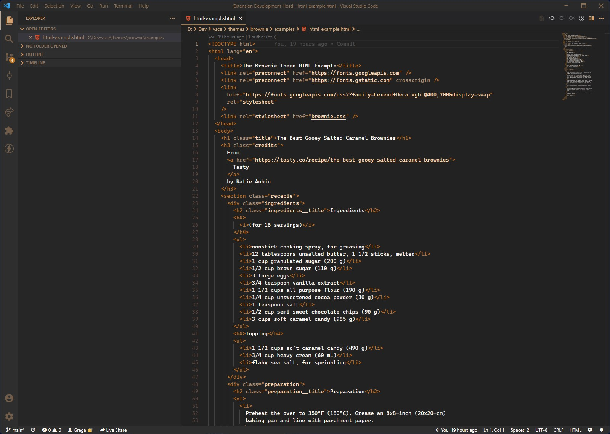
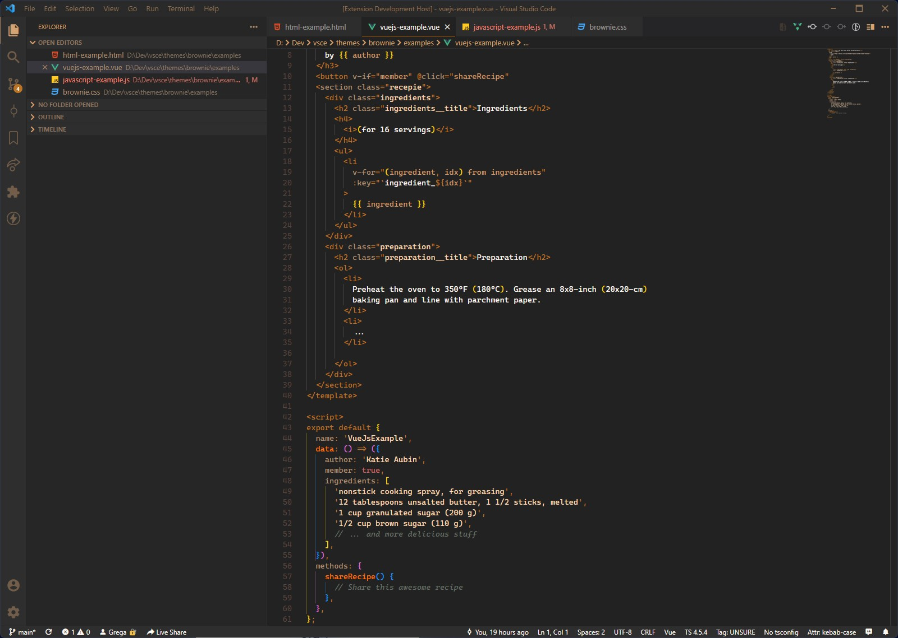
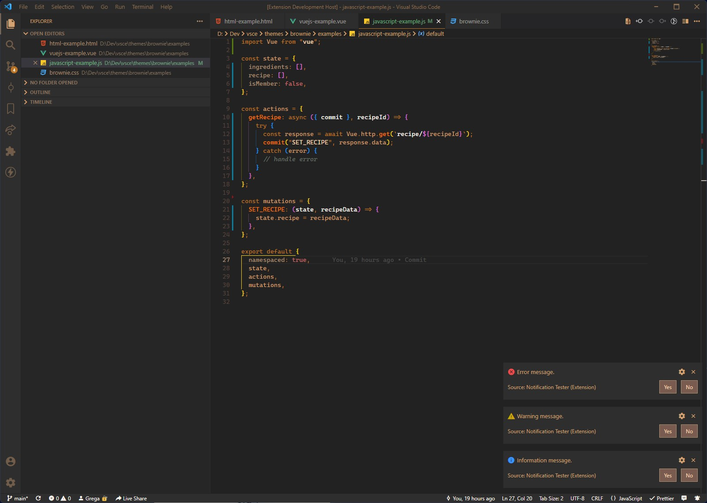
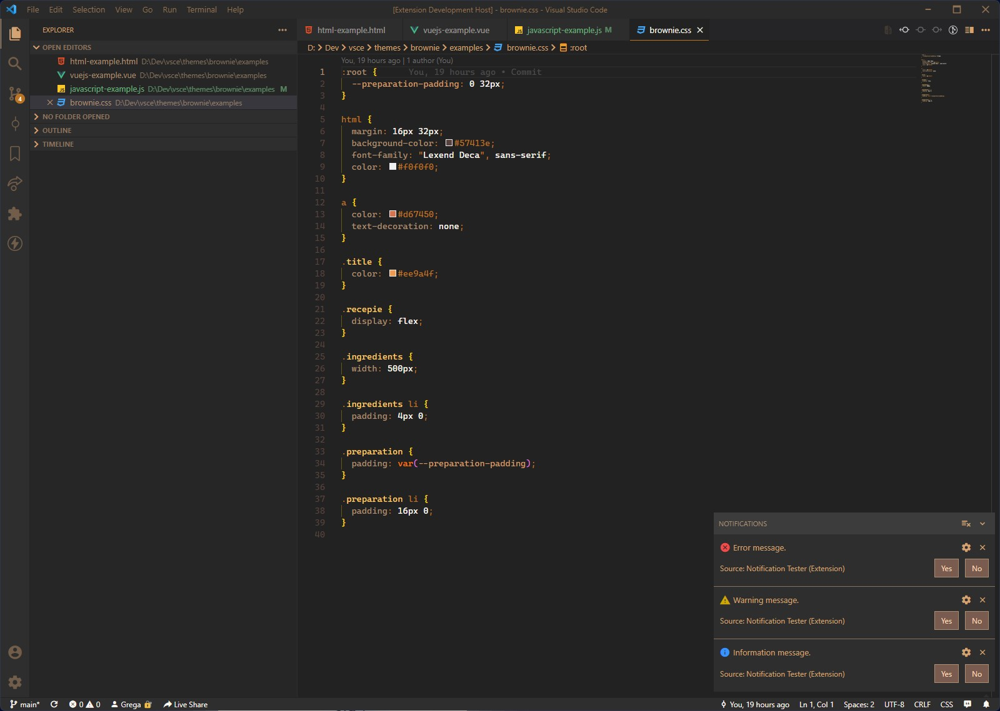

   

# 
🍪 [Brownie Theme for Visual Studio Code](https://marketplace.visualstudio.com/items?itemName=gregadro.brownie)

Experience the same pleasure when coding as when you are eating the delicious caramel salted brownie. That is where the inspiration came from. Carefully selected colors soothe the eyes as brownie would soothe your sugar craving.

 

# About

This is my first Visual Studio Code theme and currently, it is at its early stage. It was created for personal usage in the Vue.Js ecosystem. But sure it is not meant to be only for me. I would be very happy if you would enjoy it too, to receive contributions or any kind of feedback.

And if you want to say a thank you, you can buy me a coffee and support me even at my home barista hobby. ☕

 

# Installation

1. Install [Visual Studio Code](https://code.visualstudio.com/download)
2. Launch Visual Studio Code
3. In left sidebar choose **Extensions**
4. Search for **_brownie_** theme
5. Click **Install**
6. Click **Reload** to reload the Visual Studio Code
7. From the menu bar click : **Files** | **Code** -> **Preferences** -> **Color Theme** -> **Brownie**

   _Windows shortcut: <kbd>Ctrl</kbd> + <kbd>K</kbd> + <kbd>T</kbd> | Mac OS: <kbd>Cmd</kbd> + <kbd>K</kbd> + <kbd>T</kbd> -> Brownie_

  

# Screenshots

HTML

Vue.js

JavaScript

CSS

 

# SemVer

This project is following:

- [Semantic Versioning 2.0.0](https://semver.org/)
- [Keep a Changelog 1.0.0](https://keepachangelog.com/en/1.0.0/)
- [Conventional Commits 1.0.0](https://www.conventionalcommits.org/en/v1.0.0/)
